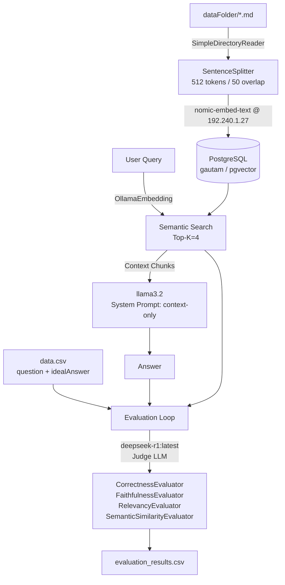

# RAG + Evaluation System — Walkthrough

## What Was Built

An integrated two-subsystem Python project at `/home/ashok/Documents/data/rag_system/`:

| File | Role |
|------|------|
| `config.py` | Shared constants (Ollama URL, DB credentials, paths) |
| `rag_system.py` | Sub-system 1: ingestion + query pipeline |
| `evaluation.py` | Sub-system 2: evaluation loop with Judge LLM |
| `main.py` | CLI entry point |
| `dataFolder/*.md` | 3 sample markdown source documents |
| `data.csv` | 9 ground-truth QA pairs for evaluation |

---

## Verification Results

### ✅ PostgreSQL + pgvector
```
PostgreSQL connection: OK
pgvector extension: ('vector', '0.8.1')
```

### ✅ Ollama Models Confirmed Running
```
Models: ['deepseek-r1:latest', 'nomic-embed-text:latest', 'llama3.2:latest', ...]
```

### ✅ Document Ingestion
```
Loaded 3 document(s).
Generating embeddings: 100% | 6/6 chunks
Ingestion complete. 3 document(s) processed.
```

### ✅ RAG Query Test
**Question**: *What is RAG and how does it reduce hallucinations?*

**Retrieved**: 4 context chunks from PostgreSQL vector store

**Answer**:
> RAG is a technique that enhances LLMs by retrieving relevant documents from an external knowledge base before generating a response. This reduces hallucinations, keeping answers grounded in verified source documents. RAG systems use an embedding model, a vector database, and an LLM to generate answers based on retrieved context.

---

## How to Use

### Step 1 — Activate environment
```bash
source /home/ashok/langchain/bin/activate
cd /home/ashok/Documents/data/rag_system
```

### Step 2 — Ingest documents (first time only)
```bash
python main.py --ingest
```

### Step 3 — Ask a question
```bash
python main.py --query "What is pgvector and what are its advantages?"
```

### Step 4 — Run full evaluation
```bash
python main.py --evaluate
```
Results are written/appended to `evaluation_results.csv` with these columns:

| Column | Description |
|--------|-------------|
| `question` | User question from data.csv |
| `rag_answer` | RAG system's answer |
| `correctness_score` | Score 1–5 from Judge LLM |
| `faithfulness_score` | 0/1 — is answer grounded in context? |
| `relevancy_score` | 0/1 — is context relevant to question? |
| `semantic_similarity_score` | 0–1 cosine similarity to ideal answer |

---

## Architecture


